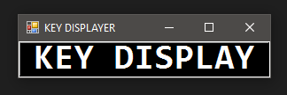

# KeyPress OSD - PowerShell Script

## Overview
KeyPress OSD is a simple PowerShell script that displays an On-Screen Display (OSD) of the keys pressed on your keyboard. This can be useful for presentations, tutorials, or accessibility purposes.

## Features
- Real-time display of keyboard and mouse key presses.
- Minimal and unobtrusive OSD design.
- Easy to use.
- Light (one file)

## Requirements
- Windows operating system 10 or 11
- PowerShell 5.1 or later

## Usage
1. Run the Script: Execute the script to open the initial window (jpg1).
    
2. Activate Key Displayer: Click the button within the jpg1 window to activate the key displayer.
3. Key Displayer Behavior:
    - The key displayer window will appear and stay on top of all other windows.
    - It will not respond to drag actions and will maintain its position.
    
4. Deactivate Key Displayer:
    - Click the key displayer window again.
    - Alternatively, press the NUM LOCK key on your keyboard to deactivate it.