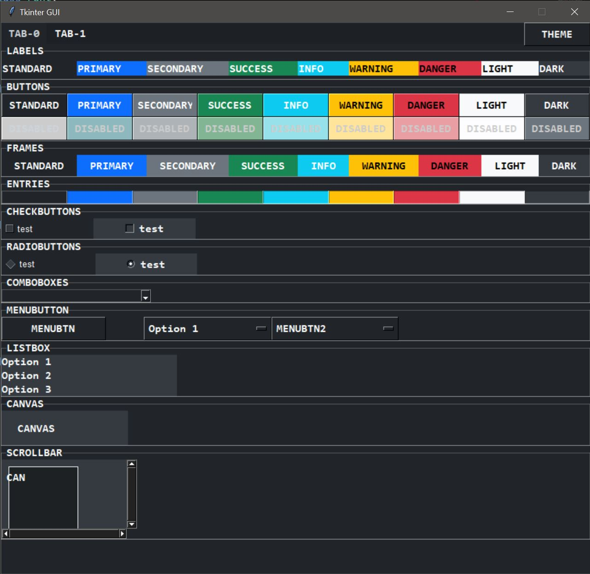
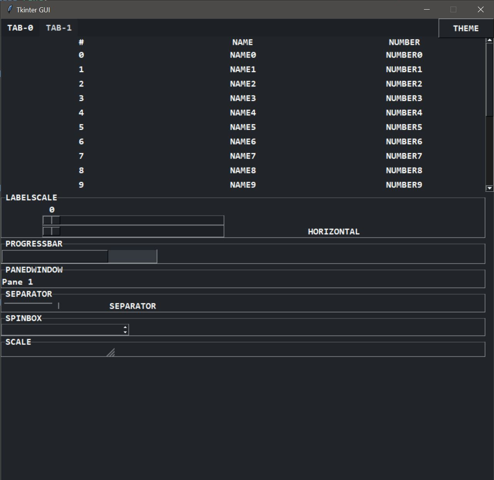

```yaml
tag:        [mini-project, tkinter, gui-template]
title:      PyTkinter GUI Template
date:       2024-09-04
update:     2024-09-10
version:    0x001a
author:     BO$
copyright:  BO$ <https://github.com/bos-8>
license:    AGPL 3.0
file:       gui.py
```
# PyTkinter GUI Template

## PURPOSE OF THE DOCUMENT
This document describes the PyTkinter GUI Template project, which provides a collection of reusable Tkinter widget templates. The aim is to help quickly create graphical user interfaces (GUIs) in Python, saving time and effort in building applications.

## DESCRIPTION / TASK CONTENT
The PyTkinter GUI Template includes various predefined Tkinter widgets such as buttons, labels, entry fields, and frames, each with customizable options. This template serves as a starting point for developing Tkinter applications, allowing users to easily modify and extend the widgets as needed.

|          TAB-0           |          TAB-1           |
| :----------------------: | :----------------------: |
|  |  |

## TECHNOLOGIES / TOOLS
- Python 3.12.4
- Tkinter
- Pip (for any dependencies, if needed)

## INSTALLATION
1. Download the `tkinter_gui_template.py` script from the repository.
2. Ensure you have Python installed (Python 3.12 or higher is recommended).
3. Install Tkinter if it's not already included in your Python installation. Usually, it comes bundled with Python on Windows and most Linux distributions.
4. Run the script using the command:
   ```bash
   python tkinter_gui_template.py
   ```

## REQUIREMENTS
```yaml
system:     Windows, Linux
python:     ">=3.12.4"
```

## EXECUTION / USAGE
- Run the script to display the GUI template.
- Use the provided widgets as examples to create your own GUI applications.
- Modify the parameters of each widget to customize their appearance and functionality.
- Extend the template with additional functionality as required for your project.

## RESOURCES / LINKS / BIBLIOGRAPHY
[GitHub `bos-8` Repository Link](https://github.com/bos-8/MicroProjects/)

## CHANGES
|    # | VERSION  |             AUTHOR             |    DATE    | DESCRIPTION                        |
| ---: | :------: | :----------------------------: | :--------: | ---------------------------------- |
|    1 | `0x0010` | BO$ <https://github.com/bos-8> | 2024-09-04 | Creation of PyTkinter GUI Template |
|    2 | `0x001a` | BO$ <https://github.com/bos-8> | 2024-09-10 | Added additional widget examples   |
