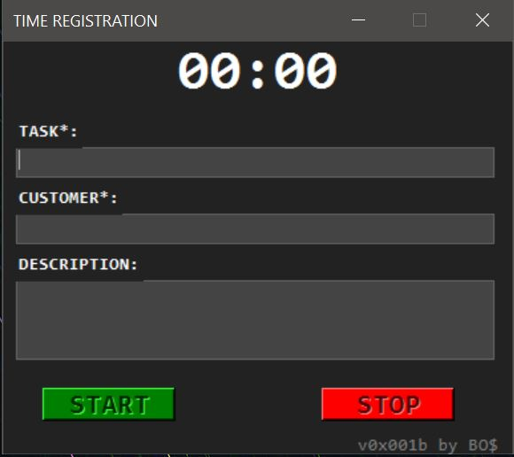

```yaml
tag:        [mini-project, time-registration, task-registration]
title:      Time Registration PowerShell Form Script
date:       2024-10-04
update:     2024-10-06
version:    0x001b
author:     BO$
copyright:  BO$ <https://github.com/bos-8>
license:    AGPL 3.0
file:       time-registration.ps1
```
# Time Registration PowerShell Form Script

## PURPOSE OF THE DOCUMENT
This document describes the Time Registration PowerShell script, which enables users to track the time spent on tasks using a graphical user interface (GUI). The tool is designed for individual users and teams looking to enhance productivity and accountability by effectively recording working hours.

## DESCRIPTION / TASK CONTENT
The Time Registration script provides a simple form interface for users to input their tasks, client details, and descriptions of the work performed. It captures the start time and end time of tasks and saves the data in CSV format for easy reporting and analysis.



## TECHNOLOGIES / TOOLS
- PowerShell
- Windows Forms
- CSV (Comma-Separated Values)

## INSTALLATION
1. Download the `TimeRegistration.ps1` script from the repository.
2. Open PowerShell.
3. Navigate to the directory where the script is saved.
4. Execute the script using one of the following methods:
   - Using the command line:
     ```powershell
     .\TimeRegistration.ps1
     ```
   - Alternatively, you can right-click on the `TimeRegistration.ps1` file and select **Run with PowerShell** from the context menu.

## REQUIREMENTS
```yaml
system:     Windows 10/11
PowerShell: 5.1
```

## EXECUTION / USAGE
- Run the script to display the time registration form.
- Fill in the task details and client (this two inputs are required) after that click the "Start" button to begin tracking time.
- When finished, click the "Stop" button to record the end time.
- The data will be saved in a CSV file on your Desktop and in the same directory as the script.
- If you exit form when timer is on script automatically save time too.

## RESOURCES / LINKS / BIBLIOGRAPHY
[GitHub `bos-8` Repository Link](https://github.com/bos-8/MicroProjects/)

## CHANGES
|    # | VERSION  |             AUTHOR             |    DATE    | DESCRIPTION                          |
| ---: | :------: | :----------------------------: | :--------: | ------------------------------------ |
|    1 | `0x0010` | BO$ <https://github.com/bos-8> | 2024-10-04 | Creation of Time Registration script |
|    2 | `0x001a` | BO$ <https://github.com/bos-8> | 2024-10-06 | Better looking form/dark mode        |
|    3 | `0x001b` | BO$ <https://github.com/bos-8> | 2024-10-06 | Add OnFormClose save data            |
